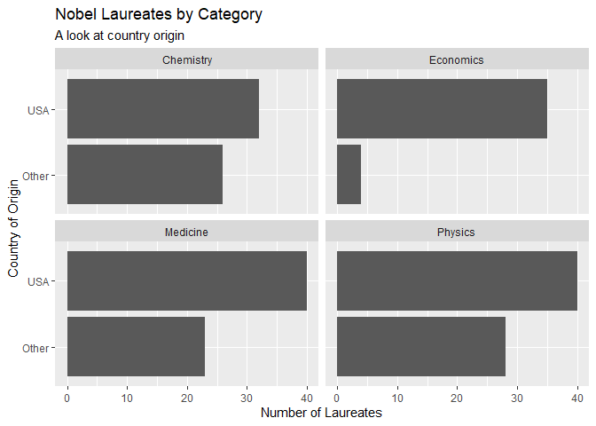

Lab 03 - Nobel laureates
================
Rachel Good
January 22, 2022

### Load packages and data

``` r
library(tidyverse) 
```

``` r
nobel <- read_csv("data/nobel.csv")
```

## Exercises

### Exercise 1

There are 935 observations and 26 variables in the nobel laureates
dataset.

``` r
spec(nobel)
```

    ## cols(
    ##   id = col_double(),
    ##   firstname = col_character(),
    ##   surname = col_character(),
    ##   year = col_double(),
    ##   category = col_character(),
    ##   affiliation = col_character(),
    ##   city = col_character(),
    ##   country = col_character(),
    ##   born_date = col_date(format = ""),
    ##   died_date = col_date(format = ""),
    ##   gender = col_character(),
    ##   born_city = col_character(),
    ##   born_country = col_character(),
    ##   born_country_code = col_character(),
    ##   died_city = col_character(),
    ##   died_country = col_character(),
    ##   died_country_code = col_character(),
    ##   overall_motivation = col_character(),
    ##   share = col_double(),
    ##   motivation = col_character(),
    ##   born_country_original = col_character(),
    ##   born_city_original = col_character(),
    ##   died_country_original = col_character(),
    ##   died_city_original = col_character(),
    ##   city_original = col_character(),
    ##   country_original = col_character()
    ## )

``` r
count(nobel)
```

    ## # A tibble: 1 x 1
    ##       n
    ##   <int>
    ## 1   935

``` r
nrow(nobel)
```

    ## [1] 935

``` r
ncol(nobel)
```

    ## [1] 26

### Exercise 2

``` r
nobel_living <- nobel %>%
  filter(gender != "org",
         !is.na(country),
         is.na(died_date))

nrow(nobel_living)
```

    ## [1] 228

### Exercise 3

Excluding the category of economics, a large portion of nobel laureates
originate outside of the United States, supporting the Buzzfeed article
headline about the importance of immigration to American Science.

``` r
nobel_living <- nobel_living %>%
  mutate(
    country_us = if_else(country == "USA", "USA", "Other")
  )
```

``` r
nobel_living_science <- nobel_living %>%
  filter(category %in% c("Physics", "Medicine", "Chemistry", "Economics"))
```

``` r
nobel_living_science %>% 
  ggplot(aes(x = country_us)) +
  geom_bar() +
  facet_wrap(~category) +
  coord_flip() +
  labs(title = "Nobel Laureates by Category", subtitle = "A look at country origin",
       x = "Country of Origin", y = "Number of Laureates")
```

<!-- -->

### Exercise 4

# for some reason born\_country does not exist

``` r
nobel_living %>% 
  mutate(
    born_country_us <- ifelse(born_country == "USA", "USA", "Other")
)
```

    ## # A tibble: 228 x 28
    ##       id firstname   surname  year category affiliation city  country born_date 
    ##    <dbl> <chr>       <chr>   <dbl> <chr>    <chr>       <chr> <chr>   <date>    
    ##  1    68 Chen Ning   Yang     1957 Physics  Institute ~ Prin~ USA     1922-09-22
    ##  2    69 Tsung-Dao   Lee      1957 Physics  Columbia U~ New ~ USA     1926-11-24
    ##  3    95 Leon N.     Cooper   1972 Physics  Brown Univ~ Prov~ USA     1930-02-28
    ##  4    97 Leo         Esaki    1973 Physics  IBM Thomas~ York~ USA     1925-03-12
    ##  5    98 Ivar        Giaever  1973 Physics  General El~ Sche~ USA     1929-04-05
    ##  6    99 Brian D.    Joseph~  1973 Physics  University~ Camb~ United~ 1940-01-04
    ##  7   101 Antony      Hewish   1974 Physics  University~ Camb~ United~ 1924-05-11
    ##  8   103 Ben R.      Mottel~  1975 Physics  Nordita     Cope~ Denmark 1926-07-09
    ##  9   106 Samuel C.C. Ting     1976 Physics  Massachuse~ Camb~ USA     1936-01-27
    ## 10   107 Philip W.   Anders~  1977 Physics  Bell Telep~ Murr~ USA     1923-12-13
    ## # ... with 218 more rows, and 19 more variables: died_date <date>,
    ## #   gender <chr>, born_city <chr>, born_country <chr>, born_country_code <chr>,
    ## #   died_city <chr>, died_country <chr>, died_country_code <chr>,
    ## #   overall_motivation <chr>, share <dbl>, motivation <chr>,
    ## #   born_country_original <chr>, born_city_original <chr>,
    ## #   died_country_original <chr>, died_city_original <chr>, city_original <chr>,
    ## #   country_original <chr>, country_us <chr>, ...

…

### Exercise 5

…

### Exercise 6

…
